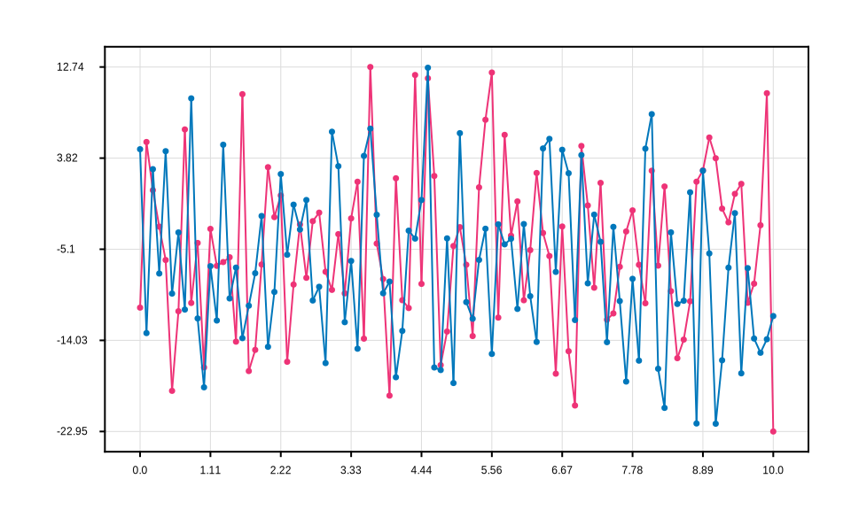
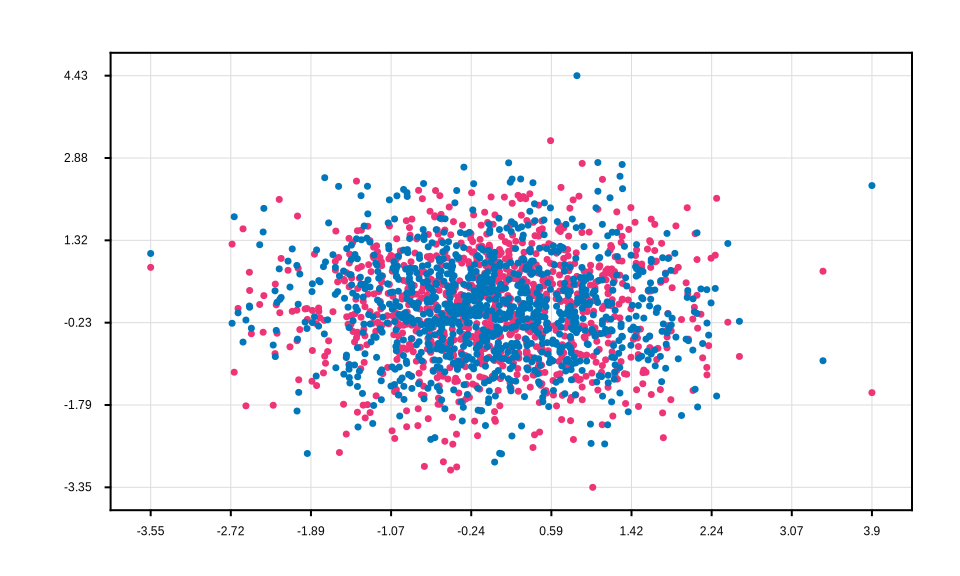
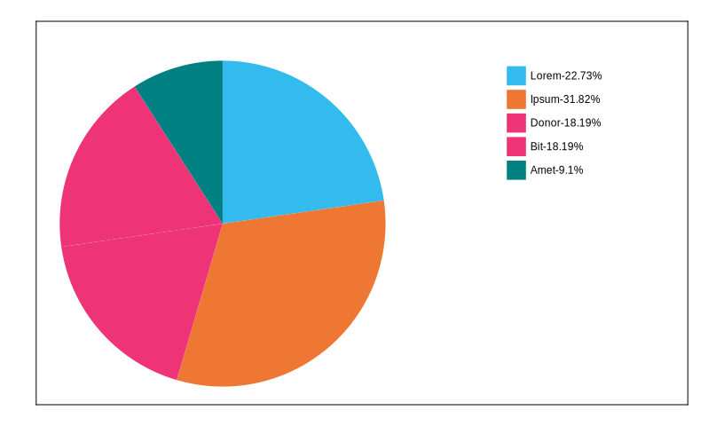

#  Matplotex

<font color="darkblue"> [**Matplotex**](https://hexdocs.pm/matplotex/Matplotex.html)</font> is a lightweight and efficient library for Elixir projects that facilitates server-side SVG generation for data visualization. Designed to integrate seamlessly with Phoenix LiveView, it serves as a powerful tool for creating dynamic visualizations in web applications. Below are the key benefits and extended use cases of <font color="darkblue"> **Matplotex**</font>:


- **Server-side SVG Generation:** <font color="darkblue"> **Matplotex**</font> enables the creation of larger, complex plots on the server, ensuring smooth performance on client-side devices with limited memory.
- **Efficient Concurrent Processing :** Leveraging Elixir’s concurrency capabilities, <font color="darkblue"> **Matplotex**</font> can handle multiple requests simultaneously, making it ideal for high-performance applications.
- **Cross-Project Compatibility :** While optimized for Elixir, <font color="darkblue"> **Matplotex**</font> can also be used by non-Elixir projects through its API integration with the Phoenix framework, broadening its potential use cases.


The sample plots generated using <font color="darkblue"> **Matplotex**</font> are shown below.

<div style="display: flex; justify-content: space-between;">
<p align="center">


</p>
</div>

<div style="display: flex; justify-content: space-between;">
<p align="center">


</p>
</div>

<div style="display: flex; justify-content: space-between;">
<p align="center"> 


</p> 
</div>


## Installation

The package can be installed by adding <font color="darkblue"> **Matplotex**</font> to your list of dependencies in `mix.exs`.

```elixir
def deps do
[
    {:matplotex, "~> 0.2.0" }
]
```

## Sample SVG generation

```elixir
x = [1, 3, 7, 4, 2, 5, 6]
y = [1, 3, 7, 4, 2, 5, 6]

frame_width = 8
frame_height = 6
size = {frame_width, frame_height}
margin = 0.05
font_size = "16pt"
title_font_size = "18pt"
ticks = [1, 2, 3, 4, 5, 6, 7]

x
|> Matplotex.plot(y)
|> Matplotex.figure(%{figsize: size, margin: margin})
|> Matplotex.set_title("The Plot Title")
|> Matplotex.set_xlabel("X Axis")
|> Matplotex.set_ylabel("Y Axis")
|> Matplotex.set_xticks(ticks)
|> Matplotex.set_yticks(ticks)
|> Matplotex.set_rc_params(
  x_tick_font_size: font_size,
  y_tick_font_size: font_size,
  title_font_size: title_font_size,
  x_label_font_size: font_size,
  y_label_font_size: font_size,
  title_font_size: title_font_size
)
|> Matplotex.show()

```
## Roadmap: What's Coming Next
We are actively working on the following improvements and additions for the <font color="darkblue"> **Matplotex**</font> library:

#### Upcoming Features for Matplotex:
- **Compatibility with Elixir Phoenix LiveView :** Seamless integration with Phoenix LiveView for real-time data visualization in web applications.
- **GUI Integration :** Adding graphical user interface (GUI) capabilities to <font color="darkblue"> **Matplotex**</font>, providing an intuitive and user-friendly experience for generating plots.
- **Support for the Nerves Framework :** Enabling real-time data visualization for embedded systems, such as sensor readings, using the Nerves framework.

Additionally, we are focused on expanding the library with a variety of new chart types to enhance its functionality and versatility. The upcoming <font color="darkblue"> **Matplotex**</font> version will also include the official Hex package, featuring all the basic chart types!!!

## Contribution
We welcome all contributions to improve the <font color="darkblue"> **Matplotex**</font> project! Here are some key ways you can contribute:

- **Propose Features :** Suggest new functionalities or improvements, including new plot additions.
- **Report Bugs :** Identify and report issues in the library
- **Review Pull Requests :** Review open contributions and share constructive feedback
- **Fix Bugs :**  Help resolve reported issues to improve the library

#### Steps to Contribute 
1.  Fork the repository.
2.  Create a new branch. 
```elixir 
    git checkout -b feature-name
``` 
3.  Make your changes.
4.  Add your changes to the branch.  
```elixir 
    git add <changed files>
```
5.  Commit your changes. 
```elixir 
    git commit -m 'Add new feature' 
```
6.  Push to the branch. 
```elixir 
    git push origin feature-name 
```
7. Open a Pull Request.

<font color="darkblue">  **Happy Contributing  !!!**</font>

